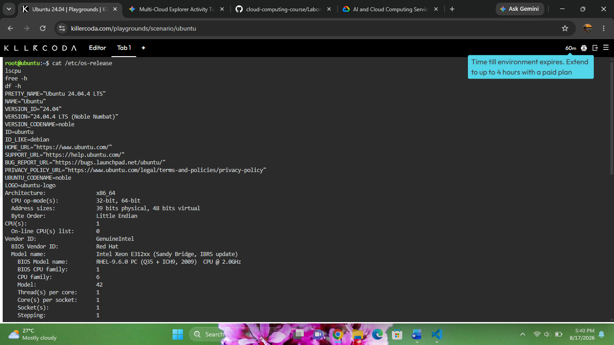
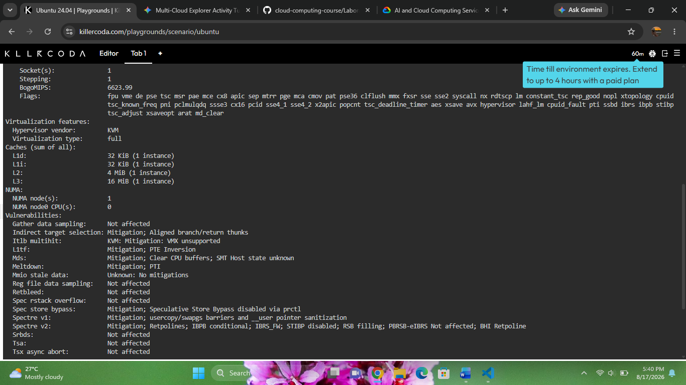
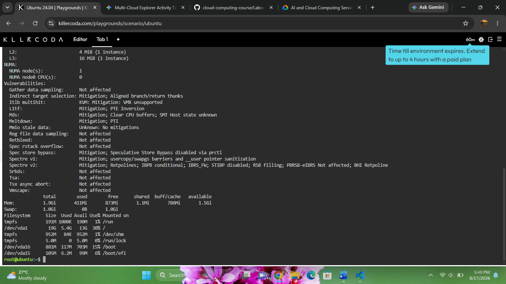

# KillerCoda Linux Investigation Results

### Commands Used & System Findings

* **Operating System Identification**
  * **Command:** `cat /etc/os-release`
  * **Result:** Ubuntu 24.04.4 LTS (Noble Numbat)

* **CPU Information**
  * **Command:** `lscpu`
  * **Result:** x86_64 Architecture, Intel Xeon E312xx (Sandy Bridge) @ 2.0GHz (1 CPU socket, 1 core, 1 thread)

* **Memory Usage**
  * **Command:** `free -h`
  * **Result:** Total: 1.9Gi | Used: 411Mi | Free: 873Mi | Available: 1.5Gi

* **Disk Space Allocation**
  * **Command:** `df -h`
  * **Result:** Root filesystem (`/dev/vda1`): 19G total, 5.4G used (30% usage), 13G available

---

### Cloud Migration Plan
If this KillerCoda Linux server were migrated to public cloud infrastructure, it could be hosted on:

* **AWS:** Amazon EC2 (Elastic Compute Cloud) running an Ubuntu 24.04 LTS AMI.
* **Microsoft Azure:** Azure Virtual Machines configured with an Ubuntu Server 24.04 image.
* **Google Cloud Platform:** Google Compute Engine (GCE) VM instance using an Ubuntu image.

---

