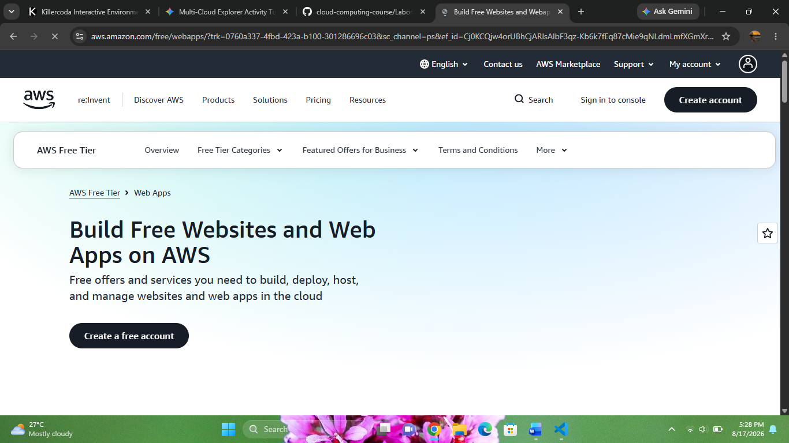

# AWS Cloud Research Report

**Brief Overview**
Amazon Web Services (AWS) is a comprehensive cloud computing platform provided by Amazon, offering over 200 fully featured services globally.

**Global Infrastructure**
AWS operates across multiple geographic Regions and Availability Zones (AZs) connected with high-bandwidth, low-latency networking infrastructure.

**Cloud Management Console**
The AWS Management Console provides a web-based graphical interface and unified management experience for accessing and administering AWS resources.

**Four Core Services**
* **Compute:** Amazon EC2 (Elastic Compute Cloud)
* **Storage:** Amazon S3 (Simple Storage Service)
* **Database:** Amazon RDS (Relational Database Service)
* **Networking:** Amazon VPC (Virtual Private Cloud)

**Three Advantages**
* Broadest set of features and deepest service offerings.
* Massive global ecosystem and community support.
* Flexible pay-as-you-go pricing models.

**Typical Enterprise Use Cases**
* Cloud-native web and mobile application hosting.
* Big data analytics and data lakes.
* Enterprise IT migration and disaster recovery.

---
### References
* Amazon Web Services. (2026). *AWS Documentation*. https://docs.aws.amazon.com/