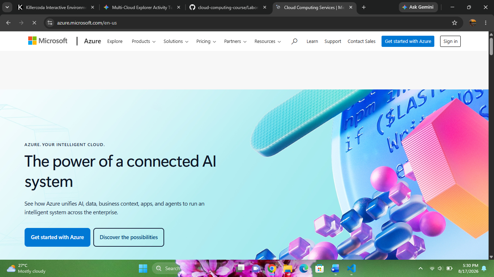

# Microsoft Azure Research Report

**Brief Overview**
Microsoft Azure is a public cloud platform offering infrastructure, platform, and software services designed to build, deploy, and manage applications.

**Global Infrastructure**
Azure consists of datacenters across global geographies, structured into regions and availability zones connected by a dedicated fiber network.

**Cloud Management Console**
The Azure Portal is a unified web-based console providing an intuitive dashboard to manage all Azure applications and services.

**Four Core Services**
* **Compute:** Azure Virtual Machines
* **Storage:** Azure Blob Storage
* **Database:** Azure SQL Database
* **Identity:** Microsoft Entra ID (formerly Azure Active Directory)

**Three Advantages**
* Seamless integration with existing Microsoft technology stacks.
* Hybrid cloud capabilities via Azure Arc.
* Enterprise-grade compliance and security governance.

**Typical Enterprise Use Cases**
* Hybrid cloud enterprise deployments.
* Modernization of legacy .NET applications.
* Enterprise directory and identity synchronization.

---
### References
* Microsoft. (2026). *Microsoft Azure Documentation*. https://learn.microsoft.com/en-us/azure/