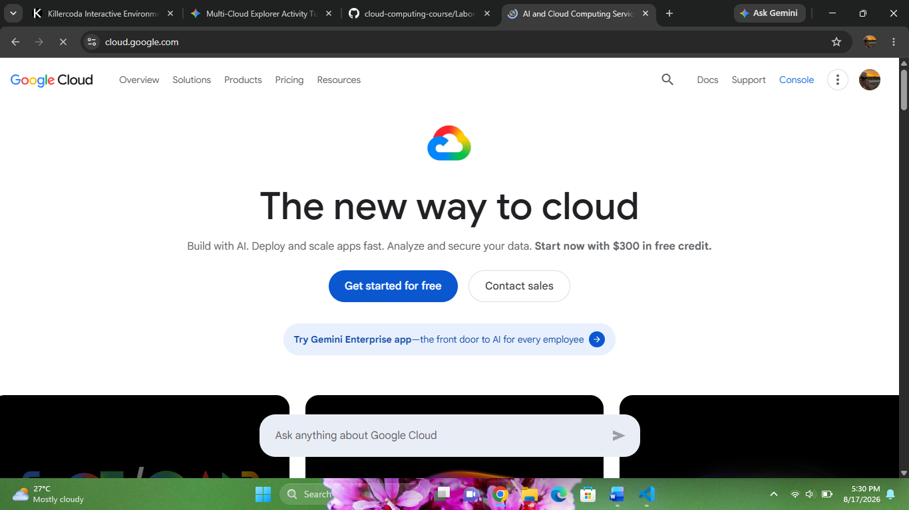

# Google Cloud Platform (GCP) Research Report

**Brief Overview**
Google Cloud Platform (GCP) offers public cloud computing services running on the same infrastructure that Google uses for its end-user products.

**Global Infrastructure**
GCP's infrastructure spans regions, zones, and edge points of presence, connected via Google's high-speed global private network.

**Cloud Management Console**
The Google Cloud Console provides an integrated web management interface for provisioning, managing, and monitoring GCP resources.

**Four Core Services**
* **Compute:** Google Compute Engine
* **Storage:** Google Cloud Storage
* **Container Orchestration:** Google Kubernetes Engine (GKE)
* **Data Analytics:** BigQuery

**Three Advantages**
* Industry-leading data analytics and machine learning capabilities.
* Native expertise in containerization and Kubernetes.
* Fast, high-performance global network infrastructure.

**Typical Enterprise Use Cases**
* Advanced AI, machine learning, and big data processing.
* Cloud-native containerized microservices architecture.
* Open-source oriented development workflows.

---
### References
* Google Cloud. (2026). *Google Cloud Documentation*. https://cloud.google.com/docs